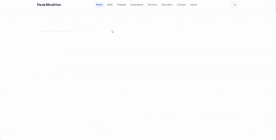

# Paula Moukhtar — Portfolio


<p align="center">
  
</p>


   

A modern, responsive personal portfolio showcasing AI/ML projects, technical skills, and professional experience. Built with React, TypeScript, and Tailwind CSS with smooth animations powered by Framer Motion.

---

## 📺 Portfolio Demo

<div align="center">
  
</div>

---

## ✨ Features

- **Responsive Design** — Fully mobile-friendly layout that works seamlessly across all devices
- **Dark/Light Theme Toggle** — User preference-aware theme switching with persistent storage
- **Smooth Animations** — Framer Motion-powered transitions and interactive elements
- **Project Showcase** — Interactive project cards with detailed modals, tech stacks, and metrics
- **Multi-section Layout** — Hero, About, Skills, Projects, Experience, Education, Services, and Contact sections
- **Icon Library** — React Icons for consistent and scalable iconography
- **Type-Safe** — Full TypeScript support for enhanced code reliability
- **Optimized Performance** — Built with Vite for fast development and production builds

---

## 🚀 Quick Start

### Prerequisites
- Node.js 16+ and npm/yarn

### Installation & Development

```bash
# 1. Install dependencies
npm install

# 2. Start development server (runs on http://localhost:5173)
npm run dev

# 3. Build for production
npm run build

# 4. Preview production build locally
npm run preview

# 5. Run linting
npm run lint
```

---

## 📁 Project Structure

```
pola-portfolio/
├── src/
│   ├── assets/                    # Static assets (images, GIFs, certificates)
│   │   ├── images/
│   │   ├── gifs/
│   │   └── certificates/
│   │
│   ├── components/                # Reusable React components
│   │   ├── layout/
│   │   │   ├── Navbar.tsx        # Navigation bar with theme toggle
│   │   │   └── Footer.tsx        # Footer component
│   │   ├── ui/                    # Shared UI components
│   │   │   ├── Button.tsx        # Reusable button component
│   │   │   ├── SectionTitle.tsx  # Section heading component
│   │   │   └── ThemeToggle.tsx   # Theme switcher component
│   │   └── project/               # Project-related components
│   │       ├── ProjectCard.tsx   # Project card display
│   │       ├── ProjectTabs.tsx   # Project details tabs
│   │       └── ProjectModal.tsx  # Project modal popup
│   │
│   ├── sections/                  # Page sections (lazy-loaded)
│   │   ├── Hero.tsx              # Hero/landing section
│   │   ├── About.tsx             # About me section
│   │   ├── Skills.tsx            # Technical skills showcase
│   │   ├── Projects.tsx          # Featured projects gallery
│   │   ├── Experience.tsx        # Work experience timeline
│   │   ├── Education.tsx         # Education background
│   │   ├── Services.tsx          # Services offered
│   │   └── Contact.tsx           # Contact/CTA section
│   │
│   ├── data/                      # Static data files
│   │   ├── projects.ts           # Projects configuration
│   │   ├── skills.ts             # Skills and proficiencies
│   │   ├── experience.ts         # Work experience data
│   │   └── certificates.ts       # Certifications data
│   │
│   ├── hooks/                     # Custom React hooks
│   │   └── useTheme.ts           # Theme management hook
│   │
│   ├── types/                     # TypeScript type definitions
│   │   └── project.ts            # Project and skill types
│   │
│   ├── App.tsx                    # Main App component
│   ├── main.tsx                   # React DOM entry point
│   └── index.css                  # Global styles
│
├── public/                        # Public assets (favicons, etc.)
├── vite.config.ts                 # Vite configuration
├── tailwind.config.js             # Tailwind CSS configuration
├── postcss.config.js              # PostCSS configuration
├── tsconfig.json                  # TypeScript configuration
└── package.json                   # Dependencies and scripts
```

---

## 🎨 Tech Stack

### Frontend Framework
- **React 18.3** — UI library for building interactive components
- **TypeScript 5.4** — Type-safe JavaScript for better developer experience
- **Vite 5.2** — Next-generation build tool for faster development

### Styling & Animation
- **Tailwind CSS 3.4** — Utility-first CSS framework
- **PostCSS** — CSS transformation tool
- **Framer Motion 11.0** — Smooth animations and interactions

### Icons & Utilities
- **React Icons 5.0** — Comprehensive icon library
- **ESLint** — Code linting and quality checks

---

## 🔧 Development Workflow

### Adding New Projects

Edit [src/data/projects.ts](src/data/projects.ts):

```typescript
export const projects: Project[] = [
  {
    id: 'unique-id',
    name: 'Project Name',
    category: 'ai', // or 'web', 'mobile', etc.
    featured: true,
    emoji: '🎯',
    chips: ['Tech1', 'Tech2', 'Tech3'],
    description: 'Short description',
    overview: 'Detailed overview',
    architecture: 'Technical architecture details',
    challenges: 'Challenges faced',
    lessons: 'Key learnings',
    metrics: [
      { value: '95%', label: 'Metric Name' }
    ],
  },
  // ... more projects
]
```

### Managing Skills

Edit [src/data/skills.ts](src/data/skills.ts) to add or modify skill categories:

```typescript
export const skillCategories: SkillCategory[] = [
  {
    id: 'category-id',
    title: 'Category Title',
    emoji: '🚀',
    skills: ['Skill1', 'Skill2', 'Skill3'],
  },
  // ... more categories
]
```

### Adding Images & Assets

1. **Images**: Place in `src/assets/images/` and import in components
2. **GIFs**: Place in `src/assets/gifs/` for project demonstrations
3. **Certificates**: Place in `src/assets/certificates/` for education section

---

## 🎯 Key Components

### Navbar
- Sticky navigation with theme toggle
- Smooth scroll to sections
- Mobile-responsive hamburger menu

### ProjectCard & ProjectModal
- Interactive project showcase with metadata
- Modal for detailed project information
- Technology stack highlighting
- Performance metrics display

### ThemeToggle
- Light/Dark mode switcher
- Persistent user preference
- Smooth transitions between themes

### Hero Section
- Eye-catching introduction
- Call-to-action buttons
- Animated background elements

---

## 🌐 Deployment

The portfolio is configured for deployment to `/Portfolio/` path:

```javascript
// vite.config.ts
export default defineConfig({
  base: '/Portfolio/', // GitHub Pages deployment path
})
```

### Build for Production

```bash
npm run build
```

This creates an optimized build in the `dist/` directory ready for deployment.

---

## 📊 Performance Optimizations

- **Code Splitting** — Sections lazy-loaded for faster initial load
- **Tree Shaking** — Unused code removed during build
- **CSS Minification** — Tailwind purges unused styles
- **Image Optimization** — Use modern formats (WebP) for images
- **TypeScript Compilation** — Type checking during build

---

## 🛠️ Configuration Files

### `vite.config.ts`
Vite build configuration with React plugin and path aliasing

### `tailwind.config.js`
Tailwind CSS customization for colors, fonts, and theme

### `tsconfig.json`
TypeScript compiler options with strict mode enabled

### `.eslintrc.cjs`
ESLint configuration enforcing code quality standards

---

## 📝 Customization Guide

### Changing Colors & Theme

Edit `tailwind.config.js`:

```javascript
module.exports = {
  theme: {
    extend: {
      colors: {
        // Add custom colors
        primary: '#your-color',
        secondary: '#your-color',
      },
    },
  },
}
```

### Modifying Sections

Each section is a standalone component in `src/sections/`. Edit them to customize content:
- Hero section messaging and CTAs
- Skills categories and proficiencies
- Projects and their details
- Timeline entries for experience/education

### Font & Typography

Customize in `index.css` and `tailwind.config.js`:

```css
@layer base {
  body {
    @apply font-sans;
  }
}
```

---

## 📱 Browser Support

- Chrome/Edge (latest)
- Firefox (latest)
- Safari (latest)
- Mobile browsers (iOS Safari, Chrome Mobile)

---

## 🐛 Troubleshooting

### Dev Server Not Starting
```bash
# Clear node_modules and reinstall
rm -r node_modules
npm install
npm run dev
```

### Build Errors
```bash
# Check TypeScript errors
npm run lint

# Clear cache
rm -r dist
npm run build
```

### Theme Not Persisting
Verify `useTheme` hook is properly implemented with localStorage

---

## 📄 License

This portfolio is personal property. Feel free to use as inspiration for your own portfolio, but do not copy the content or design without permission.

---

## 🤝 Questions?

For issues, suggestions, or improvements, feel free to open an issue or contact via the portfolio contact form.

---

<p align="center">
Built with ❤️ by Paula Moukhtar
</p>
